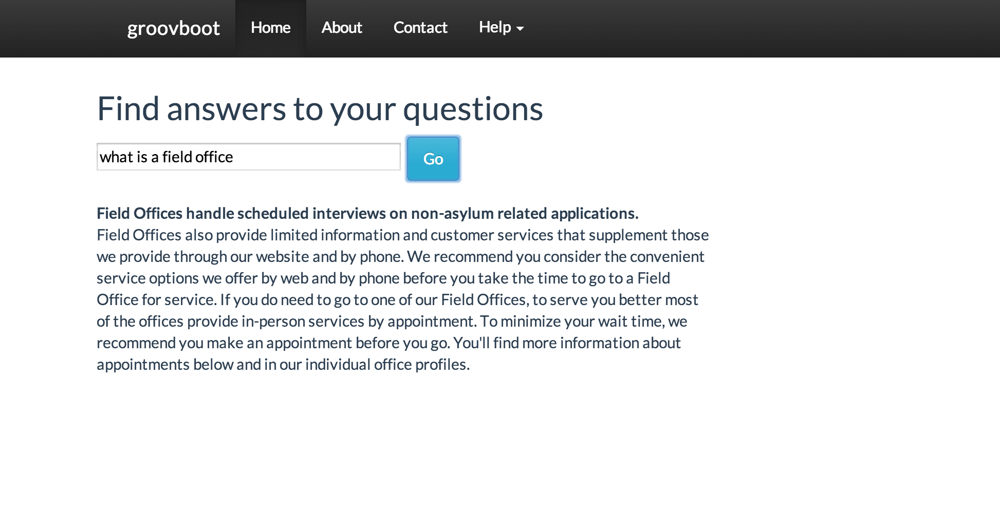

groovboot is a simple web app using Groovy and AngularJS for REST APIs powered by Spring Boot.

## 1. Required installs

* Java 8
* Git

## 2. Build test run

Just use the following command to run the Gradle build, test specs, and start the Spring Boot app on embedded Tomcat.

    $ ./gradlew clean build && java -jar build/libs/groovboot-1.0.jar

To view the app go to: 

http://localhost:8080/